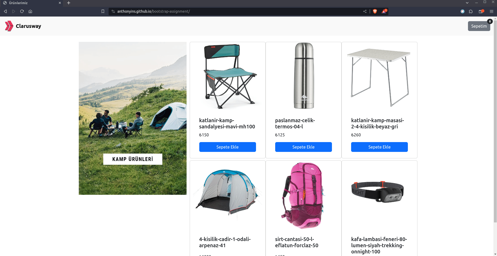

## Project Title: Bootstrap Products Page

### Description:

The Bootstrap Products Page project is a demonstration of an attractive and user-friendly web design for showcasing course links. This project focuses on enhancing Bootstrap skills, including **row**, **container**, **grid system** etc. to create a responsive bootstrap products page interface.

### Expected Outcome:

### Demo

[Bootstrap Products Page](https://anthonyins.github.io/bootstrap-assignment/)

### Note

- Please remember to customize the images and texts according to your preferences.